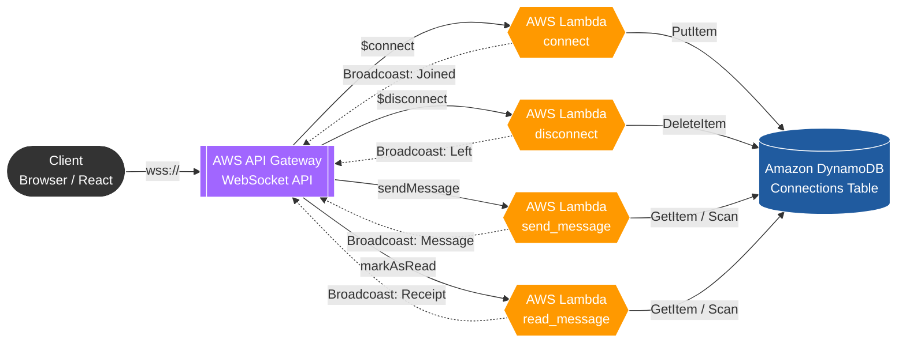

# Anonymous WebSocket Chat


這是一個基於 **Serverless Architecture** 的即時匿名聊天系統，採用前後端分離架構：前端為 React 應用，後端則完全運行於 AWS Lambda 與 DynamoDB 之上，無需管理伺服器。

## 系統架構

應用程式架構採無伺服器（Serverless）技術，呈現高度解耦設計，並使用 Mermaid 繪製 AWS 風格架構圖：



系統核心組件：

1. **Frontend:** 基於 React 託管於 GitHub Pages。負責顯示 UI，透過 `wss://` 通訊協定與後端互動。
2. **API Gateway:** 作為前端連線入口與訊息總機。根據 RouteKey（$connect, $disconnect, ...）將請求分發給對應的 Lambda。
3. **AWS Lambda:** 四個無伺服器函數處理業務邏輯。負責寫入連線資訊、廣播聊天訊息、廣播已讀回執及廣播使用者進出事件。
4. **Amazon DynamoDB:** 只作為連線池儲存當前在線者的 connectionId 與代號。採無狀態設計，不留存聊天紀錄以確保隱私。

## 📁 專案結構

```text
.
├── .github/workflows/  # CI/CD 自動化部屬腳本
├── frontend/           # 前端應用 (React + Vite + TypeScript)
│   ├── src/
│   │   ├── features/   # 延伸擴充功能模組
│   │   ├── test/       # Vitest 自動化整合測試單元
│   │   └── App.tsx     # 前端核心邏輯與連線調度
│   └── index.html
├── lambda/             # 後端 Lambda 程式碼
│   ├── connect/        # 連線處理邏輯與入室廣播
│   ├── disconnect/     # 中斷連線處理邏輯與退室廣播
│   ├── send_message/   # 訊息發送處理邏輯
│   └── read_message/   # 已讀回執處理邏輯
├── template.yaml       # AWS SAM 基礎設施藍圖
├── samconfig.toml      # SAM 部署設定檔
├── .gitignore          # 忽略清單 (自動忽略 .aws-sam/ 編譯產物)
└── README.md
```

---

## 開發環境設置

若要在本機進行開發或擴充功能，請依照下列步驟：

### 步驟一：安裝必要工具

請確保已安裝以下環境：

* **Node.js (v20+)**: 用於前端開發。
* **Python (v3.12+)**: 用於 Lambda 後端。
* **AWS CLI**: 用於管理 AWS 憑證。
* **AWS SAM CLI**: 用於打包與部署 Serverless 資源。

**安裝指令（Windows PowerShell）:**

#### 1. 安裝 AWS CLI v2
```powershell
winget install -e --id Amazon.AWSCLI
```

#### 2. 安裝 AWS SAM CLI
```powershell
winget install -e --id Amazon.SAM-CLI
```

安裝完成後，請**完全關閉**目前的 PowerShell 視窗或 VS Code，然後重新打開，這樣系統才會載入新的環境變數。重新開啟終端機後，可使用 `aws --version` 與 `sam --version` 驗證是否安裝成功。

### 步驟二：設定 Learner Lab 臨時憑證（Windows 路徑）

1. 到 Launch AWS Academy Learner Lab 的入口網頁 (即 Start Lab 的那頁)，點擊右上角 **AWS Details** -> 點擊 **AWS CLI: Show** 按鈕，複製那段包含 `[default]` 的臨時憑證。

2. 在 PowerShell 中執行以下指令，快速建立 `.aws` 資料夾與 `credentials` 檔案於 `C:\Users\<使用者名稱>\.aws\credentials`並用記事本打開：

```powershell
mkdir $env:USERPROFILE\.aws -Force
notepad $env:USERPROFILE\.aws\credentials
Rename-Item -Path "$env:USERPROFILE\.aws\credentials.txt" -NewName "credentials" -ErrorAction SilentlyContinue
```

3. 將複製的憑證貼到記事本中，存檔並關閉。

4. 在 PowerShell 執行 `aws sts get-caller-identity`，如果有出現包含 `LabRole` 的 JSON 回傳值，代表連線成功！

---

## 建置與部署

### 1. 後端部署（Backend）

本專案使用 **AWS SAM** 管理後端資源。**SAM** 全名是 **S**erverless **A**pplication **M**odel（無伺服器應用程式模型）。它是 AWS 官方推出的一個開源工具，專門用來開發和部署雲端資源。它可以協助開發者以 Infrastructure as Code（IaC）方式管理與部署 Serverless 資源。

* **Build (打包):** `sam build` 會去讀取你的 `template.yaml`檢查語法，並將程式碼編譯進隱藏的 `.aws-sam/` 資料夾。
* **Deploy (部署):** `sam deploy --guided` 會讀取設定檔，並在 AWS 上建立 API Gateway, Lambda 與 DynamoDB。

**1. 整理與打包程式碼:**
```powershell
sam build
```

**2. 部署至雲端 (第一次執行會觸發互動式引導):**
```powershell
sam deploy --guided
```
* `--guided` 是一個引導模式，它會一步一步問你問題，並把你的回答存成 `samconfig.toml`
* 接著，AWS 內部的 CloudFormation 服務會接手，嚴格依照你在 `template.yaml` 裡寫的藍圖配置好所有服務。

簡單來說：**`sam build` 負責在你的電腦上整理程式碼，`sam deploy` 負責指揮 AWS 在雲端上蓋出實體資源。**

> [!IMPORTANT]
> 部署成功後，請務必保存終端機輸出的 `WebSocketUrl`

### 2. 前端開發（Frontend）

進入 `frontend/` 資料夾進行開發：

```bash
cd frontend

# 安裝依賴
npm install

# 建立環境變數檔案
echo "VITE_WS_ENDPOINT=wss://<您複製的WebSocketUrl>/prod" > .env

# 啟動開發伺服器
npm run dev
```

---

## 持續部署 (CI/CD)

本專案配置了 **GitHub Actions**。當您推送到 `main` 分支時：

1. GitHub 會自動觸發編譯流程。
2. 系統會自動將編譯後的靜態檔案部署至 `gh-pages` 分支。
3. 您的聊天室將即時更新於 GitHub Pages 上。

## 開發注意事項

* **不要追蹤編譯檔：** 執行 `sam build` 後產生的 `.aws-sam/` 資料夾屬於編譯產物，請勿將其 commit 到 GitHub。本專案已設定 `.gitignore` 自動忽略。
* **IAM 權限：** 若使用 AWS Learner Lab 環境，在執行 `sam deploy` 時，遇到 `Allow SAM CLI IAM role creation` 請選擇 **`n`**，以確保使用 Learner Lab 提供的 `LabRole`。

---

## 使用 chat_ask_ai 功能前的本地設定

`chat_ask_ai` 使用本機 Ollama 模型產生 AI 回覆，並透過 ngrok 將本機 Ollama API 暫時公開給 AWS Lambda 呼叫。因此，如果要測試 AI 私聊功能，請先完成以下步驟。

### 1. 安裝 Ollama

到 Ollama 官網下載並安裝：

https://ollama.com/download

安裝完成後，重新開啟 PowerShell，確認 Ollama 可用：

```powershell
ollama --version
```

在powershell中鍵入
```powershell
ollama pull llama3.2
```
確認模型安裝
```powershell
Invoke-RestMethod http://127.0.0.1:11434/api/tags
```
應該會看到類似 llama3.2:latest

### 2. 安裝 ngrok
安裝 ngrok：

https://ngrok.com/download

登入 ngrok 後，到 dashboard 取得 authtoken，並執行：
```powershell
ngrok config add-authtoken 你的_ngrok_token
```

若 ngrok 指令無法使用，請到 ngrok.exe 所在資料夾執行，例如：
```powershell
cd "$env:USERPROFILE\Downloads\ngrok-v3-stable-windows-amd64"
.\ngrok.exe config add-authtoken 你的_ngrok_token
```

### 3.將本機 Ollama 公開給 AWS Lambda

啟動 ngrok tunnel：
```powershell
ngrok http 11434 --host-header="localhost:11434"
```

成功後會看到類似：
```powershell
Forwarding  https://xxxx.ngrok-free.app -> http://localhost:11434
```

請複製這個 HTTPS URL (https://xxxx.ngrok-free.app)

### 4.測試 ngrok URL 是否可連到 Ollama

另開一個 PowerShell：
```powershell
Invoke-RestMethod `
  -Headers @{ "ngrok-skip-browser-warning" = "true" } `
  https://xxxx.ngrok-free.app/api/tags
```

### 5.部署後端時帶入 Ollama 參數

```powershell
sam build

sam deploy --parameter-overrides `
  OllamaBaseUrl="https://xxxx.ngrok-free.app" `
  OllamaModel="llama3.2"
```

看到success就代表成功了！可以連 http://127.0.0.1:5173/Anonymous-WebSocket-Chat/ 試試看

### 6.之後使用就是

1.先確認 Ollama 正在跑
```powershell
Invoke-RestMethod http://127.0.0.1:11434/api/tags
```

2.開 ngrok
```powershell
ngrok http 11434 --host-header="localhost:11434"
```

3.複製 ngrok 顯示的 Forwarding URL，例如：
```powershell
https://xxxx.ngrok-free.app
```

4.測試 ngrok URL
```powershell
Invoke-RestMethod `
  -Headers @{ "ngrok-skip-browser-warning" = "true" } `
  https://xxxx.ngrok-free.app/api/tags
```

有看到 llama3.2:latest 就代表 ngrok 到 Ollama 是通的。

但如果真的動不了就算了吧哈哈哈哈，不要動到ask_ai.py還有template.yaml裡面的AskAIFunction、AskAIRoute、AskAIIntegration、AskAIPermission就好
