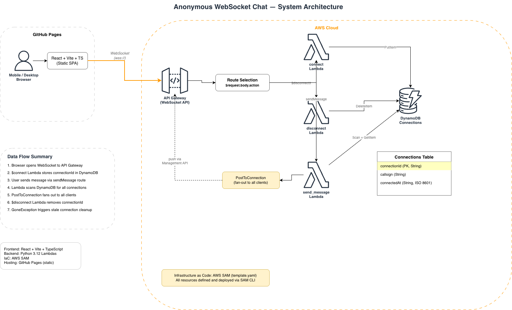

# Anonymous WebSocket Chat

A serverless, single-channel, real-time anonymous chat application. This project demonstrates a highly decoupled architecture, utilizing a cloud-native AWS serverless backend and a modern React Single-Page Application (SPA) styled with Microsoft Azure's Fluent Design system.

## System Architecture



The application strictly separates the static frontend from the cloud-native backend:

1. **Frontend:** A React + Vite SPA hosted on GitHub Pages. It maintains a persistent `wss://` connection to the backend.
2. **API Gateway:** Manages WebSocket connections natively and routes frames (`$connect`, `$disconnect`, `sendMessage`).
3. **AWS Lambda:** Three Python 3.12 functions handle the core routing logic and connection state management.
4. **Amazon DynamoDB:** An on-demand table acting as a fast, temporary registry for active `connectionId`s. Messages are ephemeral and intentionally not stored to minimize latency and data retention concerns.

## Key Features

* **Real-Time Communication:** Low-latency message broadcasting powered by AWS API Gateway WebSocket API and the `PostToConnection` management API.
* **Fully Serverless:** Scales automatically to zero when idle, minimizing cloud infrastructure costs.
* **Zero Authentication:** Frictionless entry. Users join the global channel instantly using a custom callsign.
* **Enterprise-Grade UI:** Responsive interface implementing Microsoft Azure's Fluent Design principles for optimal desktop and mobile experiences.
* **Infrastructure as Code (IaC):** All AWS resources are defined, provisioned, and managed using the AWS Serverless Application Model (SAM).
* **Automated CI/CD:** Frontend static assets are automatically built and deployed to GitHub Pages via GitHub Actions.

## Technology Stack

**Frontend**
* React 18
* TypeScript
* Vite
* Fluent Design CSS (Custom implementation)

**Backend (AWS)**
* Amazon API Gateway (WebSocket v2)
* AWS Lambda (Python 3.12)
* Amazon DynamoDB (PAY_PER_REQUEST)
* AWS SAM (Infrastructure as Code)

## Repository Structure
```text
.
¢u¢w¢w webui/                          # Frontend (React + Vite + TypeScript)
¢u¢w¢w lambda/                         # Backend Python Lambda functions
¢x   ¢u¢w¢w connect/                    # $connect route handler
¢x   ¢u¢w¢w disconnect/                 # $disconnect route handler
¢x   ¢|¢w¢w send_message/               # sendMessage route handler
¢u¢w¢w documents/                      # Architecture diagrams and specifications
¢u¢w¢w template.yaml                   # AWS SAM infrastructure definition
¢|¢w¢w README.md
```

## Local Development & Deployment

### Prerequisites
* Node.js 20+
* Python 3.12
* AWS CLI (configured with appropriate IAM credentials)
* AWS SAM CLI

### 1. Deploying the Backend
Navigate to the root directory and deploy the cloud resources using AWS SAM:
```bash
sam build
sam deploy --guided
```
*Note the `WebSocketUrl` provided in the CloudFormation outputs after deployment.*

### 2. Running the Frontend Locally
Navigate to the `webui` directory, install dependencies, and configure your environment:
```bash
cd webui
npm install
echo "VITE_WS_ENDPOINT=wss://<YOUR_API_GATEWAY_URL>" > .env
npm run dev
```
Access the application at `http://localhost:5173`.

## Continuous Deployment

The frontend is continuously deployed using **GitHub Actions**. Pushing changes to the `main` branch (specifically within the `webui/` directory) triggers a workflow that builds the Vite project and publishes the optimized artifacts to the `gh-pages` branch.